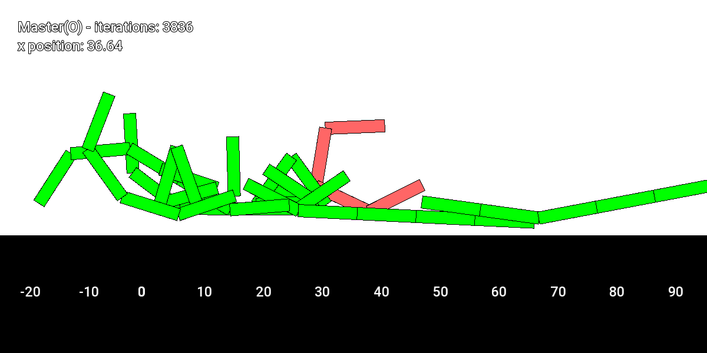
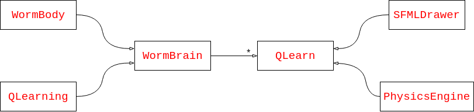
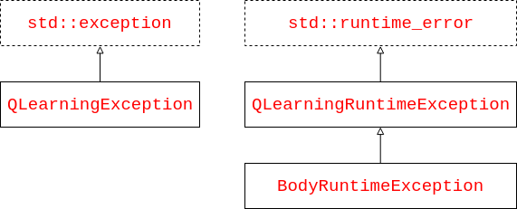

## Q-learning

* Nico Åstrand
* Marcus Myllyviita
* Anton Eklund
* Axel Neergaard


# Project Documentation
## 14/12/2018

### OVERVIEW

This Q-learning projects aims at creating a self-taught entity in an unknown environment.
What this means in the context of this project is a worm-like bot that teaches itself how to move forward – along the x-axis – in a flat world.
The implementation itself relies on multiple parts, the three largest being the actual learning (Q-learning), graphics, and physics.

The Q-learning works by keeping track of a matrix representing the states the bot can shift do.
The states are possible rotations the worm can do with its joints.
These states are update on the basis on how far along the x-axis the worm was able to move by rotating one joint.
The decision on how these joints are moved are done by the “brain” of the worm, which interfaces a q-learning object in rewards.
The best possible rotation is always based on the largest value in the matrix.
The rotations are taken care of by the “body” of the worm.
This thought process is looped until the worm bot finds an optimal state for which it receives rewards. 

The world and its physics are implemented with the physics library Box2D, and the visuals are done with the multimedia library SFML.
These work such that the Box2D library calculates the physics of the and the movement of the worm bot, while the SFML library gets the abstract shapes of the physical components and draws them onto a canvas. 

The program always starts with a default worm in red that has a set precision for rotation and four “bone”-components.
The world itself consists of a solid, straight ground on which worms move.
A visual representation of this can be seen below: 




The worms are also configurable mid-run, defined by key bindings that are specified in the *User Guide* further down this document. 

As planned in the Project Plan an iterative process was used throughout the projects lifetime, as well as pair programming to increase knowledge sharing and proper ideating. 

#### SCOPE

The minimal scope of the project – as outlined in the Project Plan – was met and exceeded.
The project contains a worm bot that is learning by itself how to move through an unknown, flat world.
The bot is parameterized properly, and can even be altered mid-run.
Parameterization also allows for bots of unbounded length – in reality bounded by computer memory. 

As the project is unique in its kind – at least in this course – it is difficult to assess which features – basic, advanced, and optional – were met.
However, in comparison to many of the proposed projects this one meets all basic features and many advanced and optional ones. 

The largest setback from the Project Plan is the absence of QT as the UI interface.
QT did not play along nicely in the project, and was deemed too excessive for the final program, both in terms of work and necessity.
The largest setback here is that there is no visual representation of how the program is working, there is not interface to see values in the world and no graphical interface to change these values.
This has been realized instead as keybindings the current SFML window and a help command that prints to std::cout. 

As improvement suggestions for the UI aspects of the project we suggest getting QT to work properly, implement an interface to see and change values, and a graphical representation of the current Q-learning matrix state – e.g. as a heatmap (the matrix gets quite large quite quickly). 

Another setback from the Project Plan was the ability to save progress of bots.
However, this was deemed to be unnecessary in the end phases of the project.
This stems from the current project state where progress of worms are short lived, it does not take many minutes for the bots to find an optimal solution and never change.
Saving this progress did not seem optimal as no changes would occur after loading the bot back into the world.
Even if the user decided to change the bot by, e.g., introducing randomness this could be tested out by reloading the program. 

As an improvement suggestion for the saving and loading aspect of the program we could have introduced the possibility to save and load the whole world itself.
This would have required some kind of structured saving system, e.g. XML or JSON, and was researched a bit and deemed possible, but not in the scope of the project in regard to the time constraints. 

#### GENERAL SUGGESTIONS AND SHORTCOMINGS

As an improvement on the Q-learning a “shared brain” solution could have been researched.
In essence this means that multiple bot brains would share a common Q-learning object to improve their movements. 

The ground in the world is not drawn correctly onto the canvas.
This could be considered a shortcoming, but not a critical bug.
Unfortunately this fix was not high enough on our priority list of fixes, and time did not allow us to fix it properly. 

The master *CMakeLists.txt* could be changes as such that it does not enable testing without an explicit argument.
Unfortunately this was realized too late and thus not implemented. 


### SOFTWARE STRUCTURE

The project is composed of 6 different classes.
A high-level diagram can be found below, arrows denoting where the class is interfaced: 



This document will outline each class one by one in the section below.
Each class description mentions libraries that are used. 

###### WormBody

The WormBody class represents and handles everything to do with the body of the worm, both graphically and physically.
A WormBody object handles only one worm body. The class takes care of creating Box2D objects representing the body in a world, specifically joints and the “meat” of the body – we call them bones.
The class also contains multiple getters and setters for these objects, and any other relevant pieces of information.
The body does not saved a reference or anything else about the world, it is only needed for Box2D part creation.

###### QLearning

The QLearning class contains all vital learning information and data about a certain worm unit.
Vital data consists of the q matrix, rewards, and states – among other non-vital data.
The current version of the class is optimized for moving in one direction, but is modular enough to be extended into an abstract class.

###### WormBrain

The WormBrain class represents the brain of a worm unit.
The brain consists of a WormBody object that is controlled, and a QLearning object that is queried for decisions on movement.
Among this the class is stateful in the sense that it contains the current QLearning state that the worm unit is in, and can optimize its current state through results from actions queried from its both companion objects.
Movements are based on the reward from rotating joints, which is the mechanic for the worm unit to interact with the world.

###### SFMLDrawer

The SFMLDrawer class works strictly as a companion object for the QLearn class.
This class is used to draw all objects in the world correctly by interfacing the SFML library, i.e. converts Box2D objects into visual illustrations onto a canvas – the program window.
The class is stateless in all aspects except for the modifiable scale variable and the input SFML window, however, these are totally dependent on the QLearn class, and the SFML window is only set once.

###### PhysicsEngine

The PhysicsEngine class essentially contains the world that all worm units exist in.
It is a small companion class to the QLearn class taking care of the Box2D world and ground creation, with a simple interface to stepping – i.e. one physics simulation loop – the Box2D world forward.

###### QLearn

The QLearn class can be thought of as the main class of the program.
The class contains all the other classes mentioned above and links actions between them.
What is meant by this is that for each iteration the QLearn class calls the processing functions for each of its companion classes, e.g. the processing of each brain and the physics simulation.
This class also works as the interface for the user by listening to user input and acting accordingly.
Please have a look at the *User Guide* section to see all user interfaces.  

###### main function

The main function works as the starter of the whole program.
This is a very short function that takes some optional arguments to create the world accordingly, i.e.create a suitable QLearn object.
Please have a look at the *User Guide* section on the use of these arguments. 

#### GENERAL

Generally the software is highly modular and a lot of care and thought has been put into each component.
Class wise the modularity is not as clear compared to methods.
Classes were initially designed to extend super classes with which we could, e.g., create multiple different bot structures.
However, this created compiling problems early in the project and the super classes were deemed unnecessary, especially since they became so small and time constraints did not allow us to test out multiple different configurations.

Method wise the program is highly modular.
This was internally realized during later stages of the project where many features were suggested by course staff and test users, and then very quickly realized in the project.

As of writing, the project is in a stage where it would be ready to test other bot structures as well, but due to time constraints this is left as an improvement suggestion. 

#### CUSTOM EXCEPTIONS

This project contains some custom exceptions used in the project.
A high-level diagram outlining the class relationships can be found below, arrows denoting *is-a* relationships: 



The base class for exceptions is `QLearningException` extending `std::exception`. 
This is used for normal exceptions, wherever they may be thrown. 

The base class for runtime exceptions is `QLearningRuntimeException` extending `std::runtime_error`.
This class is used for errors relating to outside forces of the program, e.g. missing assets files.
The `BodyRuntimeException` is used for runtime exceptions specifically in the `WormBody` class – this class extends `QLearningRuntimeException`. 


### BUILDING AND USER GUIDE

###### REQUIREMENTS

Libraries needed for this project is listed below:
    * *SFML >= 2.3*
    * *CMake >= 2.8.8*

SFML is a multi-platform and multi-language multimedia platform.
This project utilizes SFML to draw animations in order to depict the progress of moving machine learning worms.
Please visit the official [SFML website](https://www.sfml-dev.org/) if you wish to install this to your system.
Aalto computers come pre-installed with SFML version 2.3, however, if you are using a newer version of SFML – current version lies at 2.5.1 – you will notice some depreciation warnings during compilation.
Fear not, the program should still work fine. 

CMake is a multi-platform tool for building, testing, and packaging software.
This project requires version 2.8.8 at minimum – the current version lies at 3.13.1.
CMake can be found pre-installed on Aalto computers at version 3.5.1, however, if you wish to install CMake to your system please visit the [official website](https://cmake.org/).

This project comes bundled with the newest version – 2.3.1 – of Box2D, as provided from the official [GitHub repository](https://github.com/erincatto/box2d).
Please note that the newest 3 GitHub version of Box2D does not utilize CMake, but prefers PreMake.
To integrate Box2D our bundled version contains needed `CMakeList.txt` files.

For unit-testing the project utilizes the newest version of Googletest.
This library does not need to be pre-installed or downloaded, CMake does this automatically.
Please visit the official [GitHub repository](https://github.com/google/googletest) for more information. 

###### BUILDING

To build this project please ensure that you meet all the requirements above.
Also note that these instructions are written specifically for Aalto computers running Ubuntu, if you are attempting to build the project in another system the steps may vary.
1. Clone the Git repository - or download a zipped version and extract it:
```
git clone git@version.aalto.fi:elec-a7151-2018/q-learning.git
```
2. Create a new folder - for demonstration purposes we will use `src/build/` - and navigate into it:
```
mkdir src/build/
cd src/build/
```
3. Give the relative path to the `src/` folder to CMake:
```
cmake ..
```
4. After CMake is done you may use the newly create Makefile to compile the program - please note that this may take a while:
```
make
```
5. When compilation is done the executable can be found under folder `qlearn/` named `qlearn`
    - To run the executable, type `./qlearn/qlearn`
    - **Note:** you can run the executable from anywhere on your computer, but unfortunately due to time constraints some assets used by the program are hard-coded and only work when run from the created directory. The assets contain a `.ttf` file for fonts and a `.txt` file containing the help commands output.

###### USER GUIDE

Running the program as is will open a new SFML window containing one bot, the master bot in red.
This bot has a precision of 20 and bone amount of 4. 

If more bots are wanted to the world the user can run the program with arguments as follows: 
```
./qlearn/qlearn <amount> <precision> <bone_amount>
```

This will create <amount> amount of bots with precision <precision> and bone amount <bone_amount> in green.
The original master bot will also be created by default. 

*NOTE: as the q learning objects in the project use large matrices in the learning process, giving too large of a precision and/or bone amount may freeze up your whole system by using too much RAM.
The size of the matrix is:*
```
precision^(bone_amount - 1) * (1 + (bone_amount - 1) * 2)
```

When the program is executed a help string will be printed to `std::cout`.
If you wish to print again simply press `H`.
The program also contains multiple other keybindings, listed below: 

| Key     | Function                                   |
| ------- | -----------------------------------------: |
| General |                                            |
| H       | Print help string to `std::cout`           |
| Escape  | Close window and exit program              |
| M       | Switch to next master bot (if any)         |
| N       | Switch to previous master bot (if any)     |
| R       | Toggle randomness of master bot            |
|         |                                            |
| Camera  |                                            |
| <-      | Focus off master and move left             |
| ->      | Focus off master and move right            |
| +       | Zoom close to master                       |
| -       | Zoom farther from master                   |
|         |                                            |
| Physics |                                            |
| A       | Increase physics simulation speed          |
| S       | Decrease physics simulation speed          |
| Q       | Quicky iterate the bots by 1000 iterations |
| Z       | Increase motor torque of master bot        |
| X       | Decrease motor torque of master bot        |
| C       | Increase motor speed of master bot         |
| V       | Decrease motor speed of master bot         |
| P       | Toggle physics on/off                      |
| W       | Increase move reward of master bot         |
| E       | Decrease move reward of master bot         |

As the bots contain some default randomness in their selection of movement, each time the program is ran one will get a slightly differently behaving worm.
It is recommended to follow the bots through their early learning iterations as these are – by the authors opinion – quite entertaining.
The default bot can take anything from 500 iterations to 20 000 iterations before finding an optimal solution, after which there is not much new to see.
Once an optimal solution is found the bot will continue on that path for eternity, unless randomness is toggled on.

### QUALITY ASSURANCE AND TESTING

The largest contributor to software quality was the extensive use of git branches and merge requests.
These ensured that each team member had a view over what and how other team members contributed to the project.
These helped in the sense that if any mistakes were to be fixed, refactoring to be made, or general code elegance and flow to rework, then they were brought up before the merge request was accepted.

Other factors contributing to the software quality include programming practices learnt during the course, such as smart pointers and the rule of five.
Smart pointers were used in all places they were suitable and allowed.
This ensured that we had no loose gun on memory management.
The rule of five was always considered, but in the end never followed as no class needed this – even destructors were non-essential due to the proper use of smart pointers.

To test memory management and ensure its safety valgrind was used to check for leaks.
Currently there are no memory leaks found in the project with following valgrind setup:
```
valgrind --leak-check=full --show-leak-kinds=all ./qlearn/qlearn
```
This was tested on Aalto Linux computers to check for system specifics.
It is also notable that we initially wanted to parallelize the processing of each worm from the world.
However, with this setup valgrind complained of a constant amount of possible leaks found.
By searching the web a theory of this being a false alarm was born, but instead of following suspicions we decided that leaving out the parallelism was the best option – no noticeable performance hit was detected.
The parallelism was attempted with OpenMP, which should work correctly on Aalto computers. 

To test the software we mostly tested manually.
Due to the graphical nature of the program and the scope of the project, testing manually was the only viable solution in many cases.
For graphical interfaces manual testing was the most natural way to go; test and see if everything that we want are drawn correctly.
Manual testing was also deemed the optimal solution for integration testing of various components, e.g. bot and world interactions through Box2D and SFML. As an improvement to the project we could have automated this through other tools, such as [Robot Framework](http://robotframework.org/) for UI testing, however, this was out of 5 the scope of the project. 

The software design lead to problems with Unit testing, most methods were set to *private*.
We were able to automate the process of downloading Googletest and unit testing, and some tests can be found in the corresponding `test/` folder.
As an improvement to the project we could have attempted to design some private methods into companion objects and then mock them in the testing phase.
However, due to time constraints and the project scope, we were not able to fully implement this.


### WORK LOG

#### Nico Åstrand

Responsibilities
------------------------------------------------------
- BotBody

Week 45
------------------------------------------------------
- Group meeting | 3h
- Getting familiar with GIT  | 4h
- Working on project plan | 2h
- Quick meeting with Axel | 1h

Week 46
------------------------------------------------------
- Working on first implementation of BotBody | 4h
- Group meeting | 2h

Week 47
------------------------------------------------------
- Working on BotBody | 3h
- Getting familiar with Cmake | 1h
- Familiarizing with the other group-member’s code | 4h

Week 48
------------------------------------------------------
- Group meeting | 2h
- Trying to get the project to run on mac | 3h
- Getting familiar with Box2D | 1h

Week 49
------------------------------------------------------
- Group meeting | 2h
- Getting familiar with the refactored BotBody  | 1h
- Testing the project | 2h

Week 50
------------------------------------------------------
- Working on Doc | 3h
- Testing the project | 2h

#### Marcus Myllyviita

Responsibilities
------------------------------------------------------
- GUI

Week 45
------------------------------------------------------
- Group meeting | 3h
- Working on project plan | 2h
- Getting familiar with Qt | 4h
- Learning git | 4h

Week 46
------------------------------------------------------
- Group meeting | 2h
- Familiarize with SFML | 2h
- Implementing SFML to Qt-widget integration | 10h

Week 47
------------------------------------------------------
- Debugging SFML to Qt-widget integration | 5h
- Familiarizing with the other group-member’s code | 3h

Week 48
------------------------------------------------------
- Group meeting | 2h
- Learning Cmake for Qt | 1h
- Trying to find out what’s wrong with the SFML to Qt integration | 4h
- Learning SFML | 3h
- Start planning a new SFML GUI | 4h

Week 49
------------------------------------------------------
- Group meeting | 2h
- Debugging one last time SFML to Qt-integration (decide not to use QT) | 3h
- Working on SFML GUI | 2h

Week 50
------------------------------------------------------
- Working on doc and self-assessment | 3h

#### Anton Eklund

Responsibilities
------------------------------------------------------
- Physics of the world and the worm

Week 45
------------------------------------------------------
- Group meeting | 3h
- Getting familiar with Git | 3h
- Working on project plan | 2h

Week 46
------------------------------------------------------
- Group meeting | 2h
- Learning Git | 2h
- Getting familiar with Box2D | 4h

Week 47
------------------------------------------------------
- Testing different features of Box2D | 7h

Week 48
------------------------------------------------------
- Group meeting | 2h
- Building basic physics functions for the world and the worm | 6h

Week 49
------------------------------------------------------
- Group meeting | 2h
- Trying to get cmake to work on Windows | 5h

Week 50
------------------------------------------------------
- Writing documentation and assessments | 3h

#### Axel Neergaard

Responsibilities
------------------------------------------------------
- Q-Learning implementations
- Worm brain implementations
- CMake
- General assignments – efficiency, styling, etc.

Week 45
------------------------------------------------------
- Group meeting | 3h
- Working on project plan | 4h
- General project setup | 1h
- Reading up on Q-Learning | 3h
- Quick meeting with Nico | 1h

Week 46
------------------------------------------------------
- Group meeting | 2h
- Learning CMake | 3h
- Git hooks setup | 3h
- Started implementing Q-Learning | 2h

Week 47
------------------------------------------------------
- First version of Q-Learning | 5h
- Worked Bot Body | 4h

Week 48
------------------------------------------------------
- Group meeting | 2h
- Started working on Bot Brains | 8h
- Added Gtest to project | 2h
- Worked on implementing Physics | 2h
- Fixed CMake issues | 3h

Week 49
------------------------------------------------------
- Group meeting | 2h
- Iterated on Physics | 2h
- Refactored Bot Body | 3h
- Refactored SFML solution | 5h
- Documented source code | 3h
- Tested project | 3h

Week 50
------------------------------------------------------
- Prepared for meeting | 2h
- Refactored visuals | 3h
- Refactored codebase | 3h
- Refined memory management | 3h
- Working on final documentation | 4h
