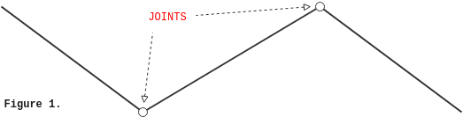
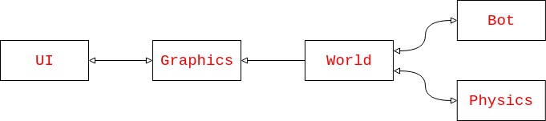
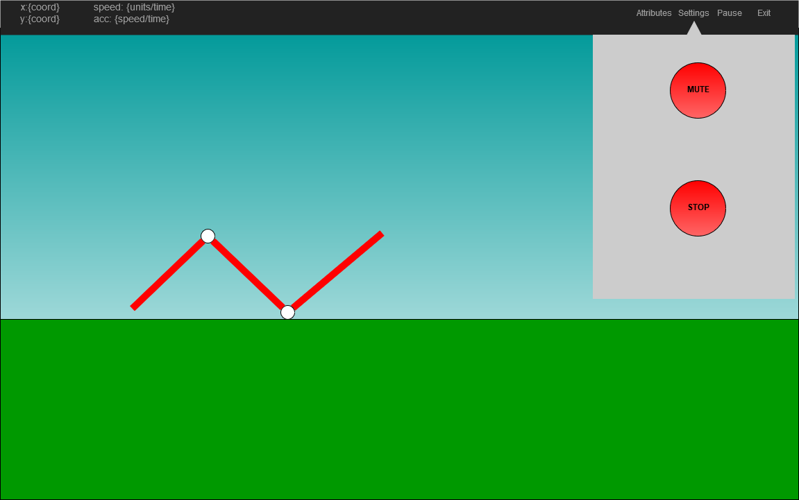

**NOTE**: below you will find the same content as in the PDF file in this directory.

However, we have also put in Markdown for easier reviewing and assessment.

--------------------------------------------------------------------------------

## Q-learning
* Nico Åstrand
* Marcus Myllyviita
* Anton Eklund
* Axel Neergaard

# Project Plan
## 09/11/2018

### Scope

The scope of the project heavily relies on the requirements set by the course. 
As a minimal implementation – our first main goal – we will meet all basic requirements. 
Optimally the group wants to meet all requirements of the project, as well as the optional requirements.

For the minimal implementation we will create a basic bot – a worm per the project proposal – that is able to do certain acts trying to achieve some goal. 
These acts would be attempting to move along a straight surface in a 2D world. 
The goal would be to traverse along the x-axis positively as far as possible. 

Which actions to perform and the result of these actions would be decided by the Q-learning algorithm. The bot – worm – could initially only be composed of three rods connected to two movable joints, depicted in Figure 1. All of these minimal requirements will ensure that each group member has something to start with: a simple bot body; a naïve Q-learning algorithm; simple physics, such as gravity and friction; and simple graphical design. 

The above scope is what the group attempts at creating as the first iteration – or milestone – in this project. 
An extension of this would include the possibility of creating more advanced bots, such as multiple joints and longer worms. 
The whole program could also be parameterized in certain aspects, such as defining the gravitational force, bot aspects, speed of Q-learning iterations, the shape of the world and so on. 
A program that is modifiable in this way would also include an extension of the GUI of the program, with input fields that would act as the parameters for the program. 
Another important extension would be possibility to save progress to a file and load this into our program. 
Such a file would not need to be human readable, but that is only speculation at this phase of the project. 

Testing and quality assurance is also a large part of the scope of the project, however, due to the sizeable weight of these they are separated into their own section. 

We will not firmly follow a standard software development framework, such as Scrum or Extreme programming, but we will still lean towards a manageable iterative process. 
From Extreme programming we will utilize pair programming and “*tests before logic*” ideologies where it makes sense. 

That concludes the project scope for team Q-learning. 
As this is a preliminary project plan everything listed above is subject to change, albeit small. 

### Program Architecture

The preliminary program architecture is simple and straightforward. 
A high-level diagram can be seen below, where arrows indicate the main dataflow. 
An explanation for each part is given under its own subheading. 

#### Bot

The bot module of the architecture consists of both the bot brain and the bot body. 
The bot body is the embodiment of the brain. 
The body queries the world for results of certain actions, e.g. what will happen to the body as a whole if I move this joint? The brain contains the learning matrices and algorithms used for decision making. 
The brain takes inputs from the body on results of actions decided by the brain. 
The bot module is only in contact with the world module, the conversation basically boils down to *action and reaction*. 

#### World

The world module is a container of both the 2D world and the physical rules inside. 
The module will work as a relay between the actions of bots and the results from the physics engine. 
It keeps track of the position of the bot – or possibly bots – and surrounding environment. 
The world will output its current state to the graphics module for further processing such as rendering. 

#### Physics

The physics module contains the physics engine used in the world. 
It does nothing else than answer queries on physical actions. 
It will *not*, for example, contain the coordinates of bots, but will instead answer to question such as “*how will this body move if this joint is rotated in a certain direction?*”. 
We will use the Box2D library for physics, as recommended by the course. 
This way it is easier to get help from course assistants and find instructions via provided links. 

#### Graphics

The graphics module will contain the graphics engine. 
This engine will decide how to draw the world by inputs from that module. 
Thus it will only need to receive input and not further query the world. 
The two-way communication line between the graphics module and UI module is due to our choice of libraries, we will use SFML which draws its content to a Qt interface. 

#### UI

The UI module will contain a simple GUI for the user to control the inputs of the bot, and to check its variable using mouse input. 
As suggested for other subjects in the course, we will use the Qt application framework for the UI. 

Below is a crude example of how the UI will be implemented:

### Preliminary Schedule

| Week  # |                                                                                                                                            |
| ------- | -----------------------------------------------------------------------------------------------------------------------------------------: |
| Week 45 | Project plan and general planning ready.                                                                                                   |
| Week 46 | Setting up development environment, get team members up to date with all technologies. First iteration of UI, physics, and model skeleton. |
| Week 47 | Implement Q-learning algorithm. Have a first basic working version.                                                                        |
| Week 48 | Iterate on Week 47 until a ready version is attained. Ensure quality metrics, e.g. code coverage should be in the high ranges.             |
| Week 49 | Project ready, final touches. Ensure quality of product; no introduction of new concepts.                                                  |
| Week 50 | Extensice quality measurements. Project done.                                                                                              |

### Roles in the group

| Title               | Name              |
| ------------------- | ----------------: |
| Bot Brain - expert: | Axel Neergaard    |
| Bot Body - captain: | Nico Åstrand      |
| GUI - guy:          | Marcus Myllyviita |
| Physics - solver:   | Anton Eklund      |

Each role above regards each members interests and skill set. 
The workload is also distributed equally between the group members, with everyone having a pair for internal design decisions. 
Through a liberal task assignment environment and rigid merge request validations each team member will also be part of each code contribution. 

### Design Rationale

The current architectural design somewhat resembles Microservice architectures, and this is not by accident. 
The design might not fully fall under Microservice architectural requirements, however the approach simplifies work distribution in the group and eases with testing and maintenance. 
Each module being an own entity enhances modularity as each part can be worked on separately. 

The decision of having the relay world module is for a central API interface for all other modules to query. 
The world module will also be able to distribute workloads to different modules, such as bot creation and reporting of physics and map geometry. 

Designing the preliminary bot as a worm creates a simple baseline to work on. 
The design choice is based on an iterative approach to software development where we want to start with a smaller problem on which we may iterate. 
This results in us starting with this simple 2 joint worm shape that we then can extend to multiple joint. 
Conceivably we may even create more intricate bots, but this is currently out of the scope of the project. 

For managing the state of learning and implement the Q-learning algorithm we have decided to incorporate 36 states for each joint used in the preliminary worm-bot design. 
Each state would correspond to a 10 degree shift from the next state, resulting in a full 360 rotation. 
Changing state of one joint would equal the bot taking an action. 
This design choice will result in an initial matrix size of 36x4 – amount of joint states times amount of input rods for each joint – which is modifiable without large effort. 

The Q-learning algorithm needs some kind of goal that it attempts at achieving to actually “learn” something. 
For our program the goal is to move as far to the right in the world we put it in, while punishing states of numbness where the bot is not moving. 

Utilizing the Google C++ style guide came naturally to the group since we are also utilizing their testing framework. 
The style guide is currently optimised for C++11 and confines the user into only using necessary parts of this enormous language. 
The guide is used by many engineers and firms alike, so we simply decided that “*if this is good enough for them, it has to be good enough for us*”. 

Libraries utilized in this project mostly come from recommendations from the course. 
We decided that if we ever are stuck on a problem with certain libraries we may simply ask the course staff for assistance. 
Box2D was chosen as our physics library, while graphics will be made with SFML – if we cannot do both with Box2D. 
Qt will be used for UI development, this is an especially good choice considering the varying OSes group members use. 
The actual use of the libraries will be discovered during the development process later on, and is thus subject to change. 

### Coding Conventions

We aim to use Google’s own [C++ style guide](https://google.github.io/styleguide/cppguide.html) ; below you can find a collection of 1 the most important choices: 

- *Most importantly*: Be consistent and use common sense. 
- The main language of the project is English, thus: 
    - All variable names will be in English 
    - Commenting  should be brief and concise, but still descriptive 
- Prefer no spaces inside parentheses 
- No tabs, only spaces. Indentation will be done with 2 spaces. 
- In conditionals the "*if*” and “*else*” keywords belong on separate lines. 
    - Space between *if* and open parenthesis, and between close parenthesis and open bracket 
    - Short conditionals may be written on the same line, without braces, if it improves readability. Otherwise use braces. 
- Classes: 
    - The *public:*, *protected:*, and *private:* keywords should be indented with one space 
    - The public section should be first, followed by the protected, and finally the private section. 
- Each line of text should at most 80 characters long. 
- Return types, parameters, and function declaration of the same line, if width allows. 
- Short and focused functions: if it extends 40 lines, splitting should be preferred. 
- *Structs*  for passive data, else use *class* . 
- General naming: 
    - Filenames are all lowercase, including dashes (-) and underscores (\_). 
    - Types are capitalized CamelCase. 
    - Variables are snake_case. 

### Testing / Quality Assurance

For testing we will utilize the Gtest library introduced in the course. 
This choice was made due to all group members being somewhat familiar with it, and due to the convenience of staff members in regard of assessments. 
Parts of the program that cannot be tested with conventional testing frameworks – such as UI – will be tested manually. 
This should be an acceptable approach in regard to the project size. 
UI elements are constantly used for further testing other modules of the program which increases the test count for the UI module. 

We will also be testing on Ubuntu driven computers at Aalto University. 
UI elements have to be verified in person, but other aspects can be tested through SSH channels and Git distribution. 
If time and setup allows we could even utilize these computers as our own ad-hoc CI tool. 

Each team member will write tests themselves for their own code. 
This ensures that a team member can properly show the quality of their code and that no team member has to solely focus on testing, i.e. tasks are distributed equally. 

For version control we use Git, this is both a group decision and a mandatory requirement for the course. 
Git will assist in quality assurance as we can isolate testing, development, and release environments properly. 
Each new feature will be developed in its own git branch, and when ready this branch will be merged into our master branch through merge requests which accompany peer reviews for quality and code cleanliness. 
